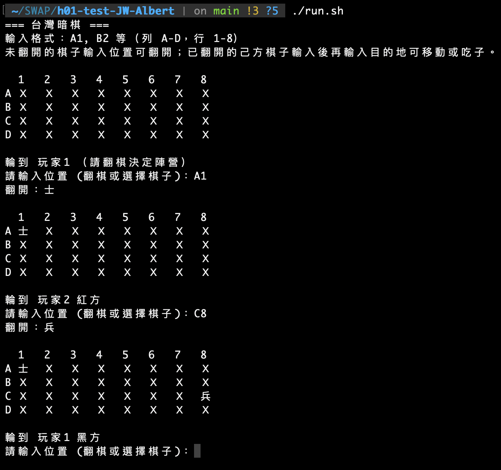

# H1 Report

- **Name:** 王建葦
- **ID:** D1210799

---

## 題目：✍ 練習 2.4.3：象棋翻棋遊戲
> [!TIP]
> * 考慮一個象棋翻棋遊戲，32 個棋子會隨機的落在 4*8的棋盤上。透過 Chess 的建構子產生這些棋子並隨機編排位置，再印出這些棋子的名字、位置
> 	* ChessGame
> 	    * void showAllChess(); 
> 	    * void generateChess();
> 	* Chess: 
> 	    * Chess(name, weight, side, loc); 
> 	    * String toString();	
> * 同上， 
>     * ChessGame 繼承一個抽象的 AbstractGame; AbstractGame 宣告若干抽象的方法：
>         * setPlayers(Player, Player)
>         * boolean gameOver()
>         * boolean move(int location)
> * 撰寫一個簡單版、非 GUI 介面的 Chess 系統。使用者可以在 console 介面輸入所要選擇的棋子的位置 (例如 A2, B3)，若該位置的棋子未翻開則翻開，若以翻開則系統要求輸入目的的位置進行移動或吃子，如果不成功則系統提示錯誤回到原來狀態。每個動作都會重新顯示棋盤狀態。
> * 規則：請參考 [這裏](https://zh.wikipedia.org/wiki/%E6%9A%97%E6%A3%8B#%E5%8F%B0%E7%81%A3%E6%9A%97%E6%A3%8B)
> 
> ```
>    1   2   3  4   5  6   7   8
> A  ＿  兵  ＿  車  Ｘ  ＿  象  Ｘ
> B  Ｘ  ＿  包  Ｘ  士  ＿  馬  Ｘ   
> C  象  兵  Ｘ  車  馬  ＿  ＿  將 
> D  Ｘ  包  ＿  士  兵  Ｘ  ＿  Ｘ  
> ```

## 設計方法概述

### 系統架構

本系統採用物件導向設計，將台灣暗棋遊戲拆解為以下類別，類別關係如下：

```
AbstractGame (抽象類別)
    ↑ 繼承
ChessGame
    ├── 使用 Chess (棋子)
    ├── 使用 Player (玩家)
    └── 使用 Chess[][] board (棋盤)
```

### 類別說明

| 類別 | 職責 |
|------|------|
| **Chess** | 棋子類別，儲存名稱、等級權重、陣營、位置及是否翻開。建構子 `Chess(name, weight, side, row, col)`，提供 `toString()`、`toDisplayString()` |
| **Player** | 玩家類別，記錄名稱與陣營（紅/黑），陣營於首次翻棋時決定 |
| **AbstractGame** | 抽象遊戲框架，宣告 `setPlayers()`、`gameOver()`、`move(int location)` |
| **ChessGame** | 繼承 AbstractGame，實作 `generateChess()`、`showAllChess()`、`flip()`、`move()` 等核心邏輯 |

### 遊戲流程設計

1. **初始化**：`generateChess()` 產生 32 子（帥將各1、仕士各2…兵卒各5），以 `Collections.shuffle()` 隨機擺放於 4×8 棋盤
2. **翻棋階段**：玩家輸入位置（如 A1），若為未翻開棋子則翻開；首次翻棋決定雙方陣營
3. **移動/吃子**：選擇己方已翻開棋子後輸入目的地，可移動至空格或依規則吃敵子
4. **勝負判定**：`gameOver()` 檢查任一方棋子是否全滅

### 台灣暗棋規則實作

- **棋子等級**：將/帥(7) > 士/仕(6) > 象/相(5) > 車/俥(4) > 馬/傌(3) > 砲/包/炮(2) > 卒/兵(1)
- **一般棋子**：可吃同級或較低級，每步僅能移動至上下左右相鄰格
- **特殊規則**：將/帥不可吃兵卒；兵/卒可吃將帥但不可吃砲；砲需跳過恰好一個炮台才能吃子，且不受階級限制

## 程式、執行畫面及其說明

### 主程式 Main.java

```java
public class Main {
    public static void main(String[] args) {
        ChessGame game = new ChessGame();
        game.run();
    }
}
```

### AbstractGame 抽象類別

```java
public abstract class AbstractGame {
    protected Player player1;
    protected Player player2;

    public abstract void setPlayers(Player player1, Player player2);
    public abstract boolean gameOver();
    public abstract boolean move(int location);
}
```

### Chess 類別

```java
public class Chess {
    private final String name;   // 棋子名稱
    private final int weight;    // 等級權重 1-7
    private final int side;      // 0=紅方, 1=黑方
    private int row, col;        // 位置
    private boolean revealed;   // 是否已翻開

    public Chess(String name, int weight, int side, int row, int col) {
        this.name = name;
        this.weight = weight;
        this.side = side;
        this.row = row;
        this.col = col;
        this.revealed = false;
    }

    public String toDisplayString() {
        return !revealed ? "Ｘ" : name;
    }
}
```

### Player 類別

```java
public class Player {
    private final String name;
    private int side;  // 0=紅方, 1=黑方，遊戲開始翻棋後決定

    public Player(String name) {
        this.name = name;
        this.side = -1;
    }
    public void setSide(int side) { this.side = side; }
}
```

### ChessGame 關鍵方法

**generateChess()** — 產生 32 子並隨機擺放：

```java
int[] counts = {1, 2, 2, 2, 2, 2, 5};  // 帥將、仕士、相象、俥車、傌馬、炮包、兵卒
for (int side = 0; side < 2; side++) {
    for (int type = 0; type < 7; type++) {
        for (int n = 0; n < counts[type]; n++) {
            Chess c = new Chess(names[type], WEIGHTS[type], side, -1, -1);
            allChess.add(c);
        }
    }
}
Collections.shuffle(allChess, random);
Collections.shuffle(positions, random);
```

**canEat()** — 吃子規則判斷（台灣暗棋特殊規則）：

```java
private boolean canEat(Chess attacker, Chess target) {
    int aw = attacker.getWeight(), tw = target.getWeight();
    if (aw == 7) return tw != 1;   // 將/帥：不可吃兵卒
    if (aw == 1) return tw == 7;   // 兵/卒：僅可吃將帥
    if (aw == 2) return false;     // 砲：不在此處理（另有 cannonMove）
    return tw <= aw;               // 一般：可吃同級或較低
}
```

**showAllChess()** — 顯示棋盤：

```java
System.out.println("\n  1   2   3   4   5   6   7   8");
for (int r = 0; r < ROWS; r++) {
    System.out.print((char)('A'+r) + " ");
    for (int c = 0; c < COLS; c++) {
        String s = (board[r][c] == null) ? "＿" : board[r][c].toDisplayString();
        System.out.print(s + "  ");
    }
    System.out.println();
}
```

### 執行流程說明

1. **啟動**：顯示 4×8 棋盤，未翻開棋子以 Ｘ 表示，空格以 ＿ 表示
2. **翻棋**：玩家 1 輸入位置（如 A1）翻棋，翻出棋子的顏色決定雙方陣營，之後輪流進行
3. **選擇**：輸入己方已翻開棋子位置，進入「選擇目的地」模式
4. **移動/吃子**：輸入目標格（如 B2），若為空格則移動；若為敵子且符合規則則吃子；失敗時顯示錯誤並回到原狀態
5. **結束**：每次操作後重新顯示棋盤，直至一方棋子全滅則遊戲結束

### 執行畫面

下圖為遊戲進行中的 Console 介面：棋盤以 Ａ～Ｄ 列、1～8 行標示，已翻開棋子顯示其名稱，未翻開顯示 Ｘ。



## AI 使用狀況與心得

### 使用層級

**層級 3**：一開始就使用 AI，搭配局部的自己撰寫。

### 互動概述

| 工具 | 用途 |
|------|------|
| Gemini | 規劃整題的撰寫方向與程式架構 |
| Cursor | 依照與 Gemini 討論的內容，完成主體架構、細節與細部實作 |
| Cursor | 完成報告的「設計方法概述」與「程式、執行畫面及其說明」 |

### 手動完成的部份

- 程式規則與台灣暗棋需求的建立
- 與 AI 的 prompt 設計與討論
- 主體架構的初步撰寫與方向規劃

### 心得與反思

這次的主題對我來說非常困難，台灣暗棋的規則（砲翻山、將帥不可吃兵卒等）需要仔細理解才能正確實作。

**AI 的實用性**：將程式規則建立好後，要求 Cursor 依照題目完成，能大幅提升開發效率。例如吃子規則 `canEat()`、砲的 `cannonMove()` 等邏輯，透過明確的規則描述即可由 AI 協助實作。

**查證與修正**：在實作過程中曾發現 `gameOver()` 初版僅計算「已翻開」的棋子，導致首次翻棋後即誤判遊戲結束。經測試後修正為計算「仍存活於棋盤」的棋子數量。

**對 OOP 的影響**：透過 AbstractGame 與 ChessGame 的繼承關係，更清楚理解抽象類別作為框架的用途；Chess、Player 等類別的職責分離，也強化了單一職責原則的觀念。